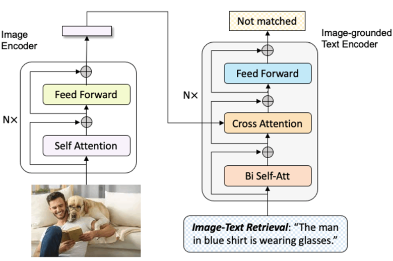

## Analyzing the Performance of BLIP on Image-Text Retrieval Task

    

To install the dependencies, run <pre/>pip install -r requirements.txt</pre> 

### Image-Text Retrieval:
1. Download Flickr30k dataset from the original websites, and set 'image_root' in configs/retrieval_{dataset}.yaml accordingly.
2. To evaluate the finetuned BLIP model on Flickr30k, run:
<pre>python -m torch.distributed.run --nproc_per_node=1 train_retrieval.py \
--config ./configs/retrieval_flickr.yaml \
--output_dir output/retrieval_flickr \
--evaluate</pre> 
3. To finetune the pre-trained checkpoint, first set 'pretrained' in configs/retrieval_flickr.yaml as "https://storage.googleapis.com/sfr-vision-language-research/BLIP/models/model_base.pth". Then run:
<pre>python -m torch.distributed.run --nproc_per_node=1 train_retrieval.py \
--config ./configs/retrieval_flickr.yaml \
--output_dir output/retrieval_flickr </pre> 

### Pre-train:
1. Prepare training json files where each json file contains a list. Each item in the list is a dictonary with two key-value pairs: {'image': path_of_image, 'caption': text_of_image}. 
2. In configs/pretrain.yaml, set 'train_file' as the paths for the json files .
<pre>python pretrain.py --config ./configs/Pretrain.yaml --output_dir output/Pretrain </pre> 

### Acknowledgement
The implementation used here solely relies on BLIP code from <a href="https://github.com/salesforce/BLIP">Salesforce </a>, <a href="https://github.com/salesforce/ALBEF">ALBEF</a>, <a href="https://github.com/huggingface/transformers">Huggingface Transformers</a>, and <a href="https://github.com/rwightman/pytorch-image-models/tree/master/timm">timm</a>. We thank the original authors for their open-sourcing.
